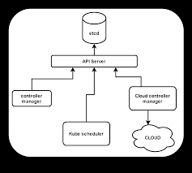

## 1. What Docker is 

**Docker** is a platform that lets you **package an application and everything it needs (libraries, dependencies, configuration)** into a **container** — a lightweight, isolated environment that runs consistently anywhere (your laptop, a server, or the cloud).
## 2. What “containerization” means

**Containerization** is the technique of running applications in **isolated user spaces (containers)** on a **shared operating system kernel**.

Each container has:
- Its own **filesystem**, built from a Docker image
- Its own **network interfaces and process space**
- Its own **dependencies** (Python, Node, Java, etc.)

…but all containers share **the same host OS kernel**.
This means containers start **fast**, use **less memory**, and can run **many per host** efficiently.
## 3. What Docker actually does under the hood

When you use Docker:
1. You define an **image** using a `Dockerfile` — describing how to build your app environment.  
    Example:
    `FROM node:18 WORKDIR /app COPY package*.json ./ RUN npm install COPY . . CMD ["npm", "start"]`
2. You build it → Docker creates an **image** (a snapshot of the environment).
3. You run it → Docker launches a **container** from that image:
    - Isolated process
    - Own filesystem (from image layers)
    - Controlled by Docker Engine
    - Shares the host OS kernel.
So, a container is just a **running instance of an image**.

## 🧠 4. How it differs from Virtualization

| Feature          | **Virtual Machine (VM)**                 | **Container (Docker)**                |
| ---------------- | ---------------------------------------- | ------------------------------------- |
| **Isolation**    | Full OS per VM (includes kernel)         | Shared OS kernel, isolated user space |
| **Startup time** | Minutes (boot a full OS)                 | Seconds (start a process)             |
| **Size**         | GBs (whole OS + app)                     | MBs (just app + libs)                 |
| **Performance**  | Some overhead (hypervisor)               | Near-native performance               |
| **Portability**  | Runs on same hypervisor                  | Runs anywhere with Docker Engine      |
| **Management**   | Managed via Hypervisor (VMware, Hyper-V) | Managed via Docker CLI / API          |

## 5. Why it’s powerful

Docker + containers give you:
- **Consistency:** Same environment on dev, test, and prod.
- **Isolation:** Apps don’t conflict over dependencies.
- **Speed:** Start/stop in seconds.
- **Scalability:** Easily replicate containers for load balancing.
- **Portability:** “Works on my machine” → “works everywhere.”

# Practically building:

To containerize an app, we need an app (obviously). For this, we can use the started app provided by docker:
- git clone [Link to repo](https://github.com/docker/getting-started-app.git)

Here, we make a `Dockerfile`. Dockerfile is the default name for text-based script containing instructions to build a Docker image. It defines the environment, dependencies, and commands required to create a containerized application. Dockerfiles enable consistent, reproducible builds and simplify deployment processes.

#### FROM keyword:
At the top of the file, we can use `FROM` keyword to import the base image.

```Dockerfile
FROM node:18-alpine

# Start from a minimal Linux image (Alpine) that already has Node.js 18 installed.
```

#### WORKDIR:

Next we can specify the `WORKDIR`. The **`WORKDIR`** instruction in a Dockerfile sets the **working directory** inside the container — kind of like doing a `cd` (change directory) in Linux.
→ Creates a directory named `/app` (if it doesn’t exist yet)  
→ Sets it as the **current working directory** for all the next commands (`COPY`, `RUN`, `CMD`, etc.)

```dockerfile
WORKDIR /app
```

#### COPY

Now we specify the files to be copied from our machine to the `/app` directory inside the container:

```dockerfile
COPY . . 
#copy from my current directory into the current directory (/app) inside the container
```

#### RUN

Executes a command to build your image (e.g. install software, compile, copy files)

```dockerfile
RUN yarn install --production
```

#### CMD:

Defines the **default command** that runs **when the container is launched**

```dockerfile
CMD ["node","src/index.js"]
```

##### Difference between CMD and RUN:

| Aspect               | RUN                                 | CMD                           |
| -------------------- | ----------------------------------- | ----------------------------- |
| **When it executes** | During image **build**              | When container **starts**     |
| **Purpose**          | Install software, setup environment | Define default command to run |
| **How many times**   | Multiple RUN commands allowed       | Only **last** CMD is used     |
| **Can override**     | No (baked into image)               | Yes (at runtime)              |
| **Modifies image**   | Yes (creates new layer)             | No (just metadata)            |
RUN - **Executes during `docker build`** - becomes part of the image
CMD - **Executes when `docker run`** - defines what the container does

#### EXPOSE

Expose the application on a port

```dockerfile
EXPOSE 3000
```


## Building an image from a Dockerfile

```bash
docker build -t foreimage .
# Build a Docker image from the Dockerfile in the current directory and name (tag) it `foreimage`.
```

## Pushing an image to docker hub:

First make a repo in docker hub, and name it, then follow the next steps:

```bash
docker tag local-image:tag new-repo:tag
# e.g docker tag myapp:latest myusernameatdocker/test-repo:latest

docker push new-repo:tag
# e.g docker tag username/test-repo:latest
```

## Running a docker image as a detached container:
```bash
docker run -dp 3000:3000 nameofimage
```

### What Are "Layers" in Docker?

When you build a Docker image, Docker doesn’t just mash your files together — it builds the image in **layers**.
Each instruction in your **Dockerfile** (like `FROM`, `RUN`, `COPY`, etc.) creates a **new layer** on top of the previous one.
You can think of it like a **stack of snapshots**:

- Each layer adds or modifies files.
- Layers are **cached** — so if one step hasn’t changed, Docker reuses it to speed up rebuilds.
- Together, these layers form the **final image**.

| Step | Instruction                                              | Meaning                                                                   |
| ---- | -------------------------------------------------------- | ------------------------------------------------------------------------- |
| 1️⃣  | `FROM node:18-alpine AS installer`                       | Start from Node 18 (Alpine). Name this stage `installer`.                 |
| 2️⃣  | `WORKDIR /app`                                           | Set working directory inside the container.                               |
| 3️⃣  | `COPY package*.json ./`                                  | Copy only package files (for better caching).                             |
| 4️⃣  | `RUN npm install`                                        | Install dependencies.                                                     |
| 5️⃣  | `COPY . .`                                               | Copy the rest of your project files.                                      |
| 6️⃣  | `RUN npm run build`                                      | Build the production-ready static files (in `/app/build`).                |
| 7️⃣  | `FROM nginx:latest AS deployer`                          | Start a fresh stage using Nginx to serve the built files.                 |
| 8️⃣  | `COPY --from=installer /app/build /usr/share/nginx/html` | Copy the build output from the first stage into Nginx’s default web root. |

#### Layer Stacking:

1. Each layer is downloaded and stored as a folder on your host machine.
2. Docker uses a **union filesystem** to stack these folders on top of each other.
3. These stacked folders appear as **one unified filesystem** inside the container.
4. When a container runs, Docker adds **one extra writable layer** on top →  
    this is where runtime changes go (`/var/lib/docker/...`).

So:
**Image layers → Read-only**  
**Container layer → Read-write**

You can run **100 containers** from the same image but each container gets its own writable layer.

You understand image layers, [read this doc](https://docs.docker.com/get-started/docker-concepts/building-images/understanding-image-layers/).

#### How containers use layers

When you run a container:

1. All image layers are stacked together to create a unified filesystem view.
2. A new writable layer is added on top specifically for that container
3. The container can make changes (create/modify files) in this writable layer
4. The original image layers stay untouched and read-only
5. Multiple containers from the same image share the same underlying layers but each has its own writable layer
## Multi-stage Docker build:

Why do we need it? **keeping images small and secure** by separating build-time dependencies from runtime dependencies.

Example of a multi-stage dockerfile:

```dockerfile
# Stage 1: Build stage
FROM node:18-alpine AS installer

# Set the working directory inside the container
WORKDIR /app

# Copy the required files to install dependencies
COPY package*.json ./

# Install dependencies
RUN npm install

# Copy the project
COPY . .

# Now build it
RUN npm run build

# This is Stage 2, the final image that will make the container.
FROM nginx:latest AS deployer

# Only copy the required directory into the image so it is minimal and small.
# This ignored the node_modules folder and such irrelevant files.
COPY --from=installer /app/build /usr/share/nginx/html
```

```bash
# Now we can run it
docker build -t multi-stage 
```
Explanation:

| Step | Instruction                                              | Meaning                                                                   |
| ---- | -------------------------------------------------------- | ------------------------------------------------------------------------- |
| 1️⃣  | `FROM node:18-alpine AS installer`                       | Start from Node 18 (Alpine). Name this stage `installer`.                 |
| 2️⃣  | `WORKDIR /app`                                           | Set working directory inside the container.                               |
| 3️⃣  | `COPY package*.json ./`                                  | Copy only package files (for better caching).                             |
| 4️⃣  | `RUN npm install`                                        | Install dependencies.                                                     |
| 5️⃣  | `COPY . .`                                               | Copy the rest of your project files.                                      |
| 6️⃣  | `RUN npm run build`                                      | Build the production-ready static files (in `/app/build`).                |
| 7️⃣  | `FROM nginx:latest AS deployer`                          | Start a fresh stage using Nginx to serve the built files.                 |
| 8️⃣  | `COPY --from=installer /app/build /usr/share/nginx/html` | Copy the build output from the first stage into Nginx’s default web root. |

##### Stage 1 — “installer” (Build Stage)

This stage is for **building** your front-end app (React, Vue, etc.) inside a Node.js environment.
1. **`FROM node:18-alpine AS installer`**
    - You start from a lightweight Linux image that already has Node.js v18 installed.
    - `AS installer` names this stage “installer,” so you can refer to it later.
    > Think of this as setting up your _build workshop._
2. **`WORKDIR /app`**
    - Creates a directory `/app` inside the container (if it doesn’t exist).
    - Then sets it as the current working directory.
    - All future commands will run from inside `/app`.
3. **`COPY package*.json ./`**
    - Copies your `package.json` (and `package-lock.json` if it exists) from your computer into the container’s `/app` folder.
    - This lets Docker cache dependency installation — if your code changes but your dependencies don’t, it won’t reinstall everything.
4. **`RUN npm install`**
    - Runs inside the container.
    - Installs all project dependencies defined in `package.json`.
    - The installed `node_modules` now live inside `/app`.
5. **`COPY . .`**
    - Copies the rest of your source code from your local machine into the container’s `/app` directory.
    > At this point, your entire project is inside the container.
6. **`RUN npm run build`**
    - Runs your build command (for example, in React, this generates a `/app/build` folder with static HTML/CSS/JS files).
    - These are production-optimized assets — they no longer need Node.js to run.    
    > This finishes the “build workshop” stage — you’ve built the product.
##### Stage 2 — “deployer” (Runtime Stage)

Now that you’ve built the static website, you want to serve it using **Nginx**, a lightweight, fast web server.
1. **`FROM nginx:latest AS deployer`**
    - Starts a new stage — clean, fresh image with Nginx installed (no Node.js here).
    - Think of this as your _delivery truck_ — just holds the final product.

2. **`COPY --from=installer /app/build /usr/share/nginx/html`**
    - Copies the **compiled build files** from the `installer` stage’s `/app/build` folder into Nginx’s default web directory (`/usr/share/nginx/html`).
    - This means when Nginx runs, it’ll serve your built website.

### Inspecting a container:

See logs:
- `docker logs <id/name>`

Inspect:
- `docker inspect <id/name>`


[ABOUT DOCKER STORAGE](./docker-storage)


# Kubernetes:

**Kubernetes** (often abbreviated as K8s) is an open-source platform for automating the deployment, scaling, and management of containerized applications. It acts as a "container orchestration" tool.

### Simple explanation of components:

Think of an apartment complex with different wings (North, south, east, west):

- The apartment complex is the `cluster`.
- `Namespaces` is like a different _wing_ or _section_ of the apartment complex.
- `Worker Node` is a floor/building in the apartment complex.
- `Pod` is a singular unit of apartment.
- `Container` are the different "roommates" living inside the `pod`. Containers share kitchen (networking) and other resources inside the `pod`.
## Core Concepts

##### **1. Cluster**

A Kubernetes **cluster** is a set of machines (physical or virtual) that run containerized applications.  
It consists of:

- **Control Plane** → manages the cluster
- **Worker Nodes** → run the application workloads
##### **2. Control Plane**

The control plane is responsible for the global decisions in the cluster, such as scheduling and maintaining the cluster state.  
It includes:
- **kube-apiserver** – central API component; entry point for all cluster operations
- **etcd** – key-value store holding the cluster’s state
- **kube-scheduler** – schedules pods onto nodes
- **kube-controller-manager** – runs node, pod, replication, endpoints, and namespace controllers
- **cloud-controller-manager** – integrates cloud provider APIs (load balancers, storage, etc.)
##### **3. Worker Node**

A worker node runs the actual application workloads.  
Each node contains:

- **kubelet** – communicates with the control plane; ensures containers defined in Pod specs are running
- **kube-proxy** – manages networking rules and pod-to-pod communication
- **Container Runtime** (containerd, Docker, CRI-O) – runs containers

##### **4. Pod**

A **pod** is the smallest deployable unit in Kubernetes.  
It is an abstraction over one or more tightly coupled containers that share:
- network namespace (IP + ports)
- storage volumes
- lifecycle

Kubernetes schedules pods, not containers.

###### High-level overview of how provisioning works:



**1. User sends a request using `kubectl`**
- `kubectl` sends the request to the **kube-apiserver** through REST API.
- Authentication + authorization + admission control happens here.

**2. `kube-apiserver` validates the request**
If request is valid, the API server:
- Writes the **desired state** (e.g., new Pod or Deployment) into **etcd**  
    → etcd is the **source of truth**.
- Important: The API server never directly talks to scheduler or kubelet to “tell them what to do.”

**3. Scheduler detects an _unscheduled_ Pod**
- Scheduler **watches the API server** for pods that **have no assigned node**.
- Scheduler decides the best available node.
- Scheduler sends a **binding object** back to the API server specifying:  
    → "This pod should run on Node X"
- Scheduler does **not** send instructions to kubelet or nodes.

**4. API server updates etcd with the node assignment**
- API server stores the scheduler's binding (pod → assigned node) in etcd. 

**5. Kubelet on the chosen node sees a new Pod assigned to it**
- Kubelet **watches the API server** for pods assigned to its node.
- Kubelet retrieves the pod spec.

**6. Kubelet instructs the Container Runtime**
- Kubelet uses CRI (container runtime interface) to ask container runtime (containerd, CRI-O, Docker) to:
    - pull images
	- create containers
    - start container.
This is the **actual provisioning** step.

**7. Kubelet reports status back to API server**
- Pod phases: Pending → Pulling → Running / Failed / etc.
- API server updates etcd again.

**8. API server returns updated info to the user (kubectl)**
- When the user runs `kubectl get pods`, it is reading the state the kubelet already reported.


### Kind:

For this tutorial, we will be practicing with K8s locally, and for that we have a tool named kind which can installed on windows with choco package manager.

```ps1
choco install kind
```


##### **5. Deployment**

A **Deployment** is a higher-level object that defines:

- how many replicas of a pod should run
- update strategy (rolling updates, rollbacks)
- desired state for the app

Kubernetes controllers ensure the actual state matches the desired state defined in the Deployment.

##### **6. ReplicaSet**

A ReplicaSet guarantees that a specified number of pod replicas are running at all times.  
Deployments use ReplicaSets under the hood.
You rarely manage ReplicaSets directly.
##### **7. Service**

A **Service** exposes a set of pods as a stable network endpoint.
Since pod IPs are ephemeral, a Service provides:
- stable virtual IP (ClusterIP)
- load balancing across pods
- internal or external exposure
Types:

- **ClusterIP** (default, internal only)
- **NodePort** (exposes on each node’s port)
- **LoadBalancer** (provisions cloud load balancer)
- **ExternalName** (DNS alias to external service)
##### **8. Ingress & Ingress Controller**

Ingress provides **L7 routing** (HTTP/HTTPS) to expose applications using rules (paths, hostnames).
It requires an **Ingress Controller**, such as:
- NGINX Ingress
- HAProxy Ingress
- Traefik
- Azure Application Gateway Ingress Controller (AGIC)

Ingress enables advanced features:
- TLS termination
- URL-based routing
- Host-based routing
- WAF integration (depending on controller)
##### **9. ConfigMap**

A **ConfigMap** stores non-sensitive configuration data as key-value pairs.
- Injected via environment variables
- Mounted as files
- Decouples configuration from container images

##### **10. Secret**

A **Secret** stores sensitive data (passwords, API keys, certs) encoded in base64.
Supports:
- env variables
- volumes
- imagePullSecrets

Can integrate with external secret managers (Azure Key Vault, AWS Secrets Manager, HashiCorp Vault).
##### **11. Volume / Persistent Volume / Persistent Volume Claim**

###### **Volume**
Temporary storage inside a pod.
###### **PersistentVolume (PV)**
Cluster-level storage resource (backed by disk, cloud storage, NFS, etc.)
###### **PersistentVolumeClaim (PVC)**
A request for storage from a PV.
PVC binds to an available PV automatically.
Most cloud clusters use **dynamic provisioning** via StorageClass.
##### **12. Namespace**

Namespaces logically isolate resources inside a cluster.
Useful for:
- separating environments (dev/test/prod)
- RBAC boundaries
- limiting resource usage
- multi-team clusters
##### **13. DaemonSet**

A workload that ensures a pod runs on **every** node (or specific node groups).
Used for:
- logging agents (Fluentd)
- monitoring agents (Prometheus node exporter)
- network plugins (CNI components)    
##### **14. StatefulSet**

Manages stateful applications where pods require:
- stable network identity
- persistent storage tied to each replica
- ordered startup/shutdown

Used for:  
Databases, Kafka, or anything needing stable storage.

##### **15. Job & CronJob**
###### **Job**
Runs a task **once** until completion.
###### **CronJob**
Runs tasks **periodically** (like crontab).
##### **16. Horizontal Pod Autoscaler (HPA)**
Automatically scales pod replicas based on metrics:
- CPU
- memory
- custom/external metrics (Prometheus, KEDA)
##### **17. Network Policies**

Firewall-like rules to control pod-level network traffic.
Defines:
- which pods can talk to which pods
- ingress/egress rules
Not enforced unless the CNI supports them (Calico, Cilium, Azure CNI)
##### **18. CNI (Container Network Interface)**

Defines how pod networking works.
Common CNIs:
- Calico
- Cilium
- Flannel
- Azure CNI
- AWS CNI
Controls pod IPs, routing, network policies.
##### **19. CRDs (Custom Resource Definitions)**

Allows extending Kubernetes with custom APIs.
Used by tools like:
- ArgoCD
- Cert-Manager
- Prometheus Operator